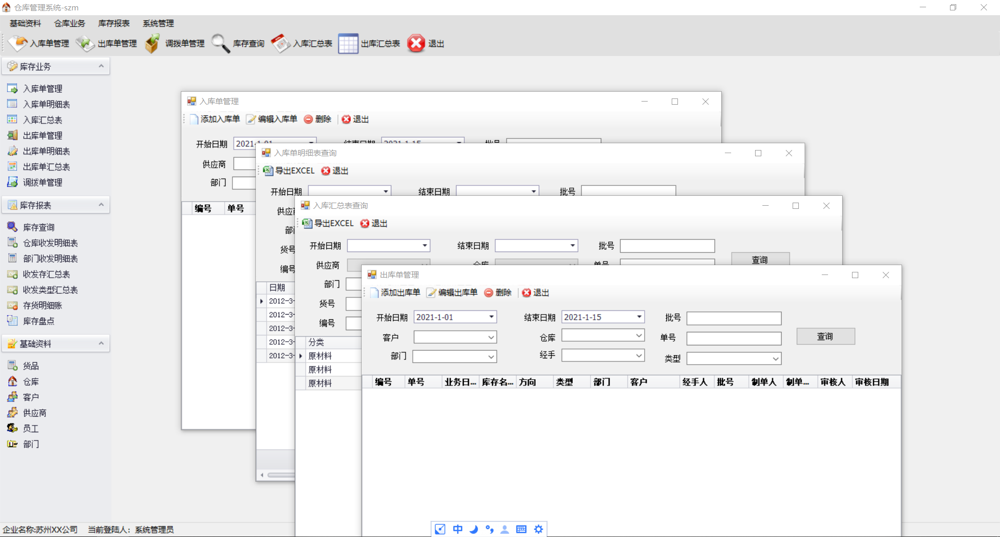

# Winform-WMS

### 0. 简介

* **非我原创**
* 源代码是基于Vs2010,Devx8.0开发的，当前源码已经被我升级到Vs2019，Devx18.1
* 基于Winform，使用DevExpress的一个简单WMS
* 完整的数据库文件在DB文件夹中，默认的MDF应该是MSSQL2008版本，其中DB_MSSQL2014文件夹中的为MSSQL2014的数据库文件
* 登陆用户：系统管理员：1

### 1. 界面如下

